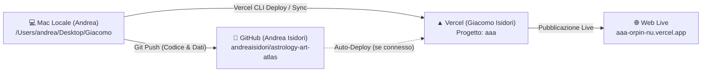

# AAA — Astrology Art Atlas
## Documento di Knowledge Transfer & Guida Operativa

Questo documento fornisce una panoramica completa dell'architettura del progetto **Astrology Art Atlas (AAA)**, pensata sia per profili tecnici che per curatori o gestori del progetto. Spiega dove risiedono i file, chi gestisce i vari account, come interagiscono i sistemi e quali passaggi seguire per ogni futura modifica.

---

## 1. La Mappa dell'Ecosistema: Chi Fa Cosa e Dove Risiede



### Scheda delle Entità e degli Account

| Livello | Posizione / Account | Identificativo / URL | Ruolo |
| :--- | :--- | :--- | :--- |
| **Locale (Mac)** | Cartella di lavoro locale | `/Users/andrea/Desktop/Giacomo` | Ambiente in cui si sviluppa il codice, si testa in locale e si gestiscono i file sorgente. |
| **GitHub** | Account: `andreaisidori` | [github.com/andreaisidori/astrology-art-atlas](https://github.com/andreaisidori/astrology-art-atlas) | Repository Git centrale (pubblico) dove è archiviato e versionato l'intero codice sorgente e il dataset `atlas.json`. |
| **Vercel** | Account: `giacomoisidori-2449s-projects` | Progetto `aaa` su [vercel.com](https://vercel.com) | Piattaforma di Cloud Hosting che compila il sito e lo rende accessibile su Internet in tutto il mondo. |
| **Dominio Live** | Sito di Produzione | [https://aaa-orpin-nu.vercel.app/](https://aaa-orpin-nu.vercel.app/) | L'indirizzo pubblico visitabile dagli utenti finali. |

---

## 2. Architettura del Progetto e Componenti Chiave

Il progetto è una Single Page Application (SPA) contemporanea, performante e reattiva, basata su **React**, **Three.js / React Three Fiber** e **Tailwind CSS**, creata con **Vite**.

```
Giacomo/
├── public/
│   └── data/
│       └── atlas.json          # DATABASE DEL PROGETTO (Opere, Info Progetto, Bio)
├── src/
│   ├── components/
│   │   ├── 3d/                 # SPAZIO 3D (Volta celeste, nodi, linee)
│   │   │   ├── CelestialSphere.jsx   # Cupola astronomica e navigazione 360°
│   │   │   ├── ArtworkNode.jsx       # Singola opera 3D (forma, colore segno, aura)
│   │   │   └── ConstellationLines.jsx# Linee di congiunzione tra le opere dei 12 segni
│   │   ├── ui/                 # INTERFACCIA UTENTE 2D
│   │   │   ├── Header.jsx            # Logo, tooltip, crediti, pulsante curatore/bio
│   │   │   ├── InfoModal.jsx         # Finestra "Informazioni sul progetto" (3 box dinamici)
│   │   │   ├── ArtworkModal.jsx      # Scheda dell'opera (titolo, autore, interpretazione)
│   │   │   └── FilterPanel.jsx       # Filtri per segno zodiacale, elemento, secolo
│   │   └── admin/              # PANNELLO CURATORE
│   │       └── AdminCuratorPanel.jsx # Editor visuale per testi, bio, opere e box
│   ├── utils/
│   │   └── astronomy.js        # Calcoli astronomici (RA/Dec), coordinate 3D, palette colori
│   ├── App.jsx                 # Componente radice e gestione dello stato globale
│   └── main.jsx                # Entry point dell'applicazione
├── dist/                       # Cartella compilata generata dal build per il web
├── package.json                # Dipendenze e script npm
└── .vercel/project.json        # Configurazione di collegamento al progetto Vercel
```

---

## 3. Elementi Funzionali Principali

### A. Il Database Centrale (`public/data/atlas.json`)
Tutti i contenuti testuali e le opere non sono "scolpiti nel codice", ma risiedono in questo file JSON:
- `opere`: Array di tutte le 177 opere (coordinate celesti, segno, autore, anno, immagine, interpretazione curatoriale, colore).
- `progetto.info`: Testi concettuali, crediti e i **3 box informativi** (*Esplorazione 360°*, *Riconfigurazioni*, *Archivio Bianco*).
- `progetto.curatore`: Biografia, statement e contatti del curatore (Giacomo Isidori).

### B. I Colori dei Segni e i Nodi 3D (`src/utils/astronomy.js` & `ArtworkNode.jsx`)
- Ognuno dei 12 segni zodiacali ha una tinta cromatica specifica definita in `astronomy.js`.
- Le forme geometriche delle opere nello spazio 3D e le linee di costellazione assumono in modo armonico e coerente il colore del rispettivo segno (incluso lo Scorpione nero antracite `#28282D` con alone scuro fumoso).

### C. La Finestra Informativa (`InfoModal.jsx`)
- Mostra il concept curatoriale, il passaggio dalla volta web all'installazione su cupola e i 3 box operativi che si aggiornano automaticamente quando vengono modificati da `atlas.json` o dal pannello curatore.

### D. Il Pannello Curatore (`AdminCuratorPanel.jsx`)
- Accessibile direttamente dall'interfaccia premendo la combinazione segreta o il link curatore.
- Permette di modificare opere, testi generali, biografia e i titoli/descrizioni dei 3 box con salvataggio ed esportazione.

---

## 4. Guida Operativa: Come Effettuare Modifiche

Ogni volta che si desidera fare una modifica al progetto, la procedura è divisa in tre semplici fasi: **Modifica**, **Test/Verifica**, e **Pubblicazione**.

### Fase 1: Modifica
- **Se vuoi modificare testi o aggiungere opere**: puoi modificare direttamente `public/data/atlas.json` (oppure usare il Pannello Curatore).
- **Se vuoi modificare elementi grafici/interfaccia**: modifichi i file in `src/components/...`.

### Fase 2: Test Locale sul Mac
Nel terminale posizionato nella cartella del progetto:
```bash
npm run dev
```
Apri il browser su `http://localhost:5173` per verificare le modifiche in tempo reale.

---

### Fase 3: Pubblicazione Online (Deploy)

Ci sono due modi rapidi per inviare le modifiche su **`https://aaa-orpin-nu.vercel.app/`**:

#### Opzione A: Deploy Diretto da Terminale (Consigliato - Immediato)
Esegui questo singolo comando dal terminale del Mac:
```bash
npm run build && npx vercel --prod --token=<TUO_TOKEN_VERCEL> --yes
```
*Questo comando compila il progetto e lo pubblica istantaneamente su Vercel in circa 20-30 secondi.*

#### Opzione B: Aggiornamento del Repository GitHub
Per mantenere il repository GitHub `andreaisidori/astrology-art-atlas` sempre allineato:
```bash
git add .
git commit -m "Descrizione delle modifiche fatte"
git push https://<TUO_TOKEN_GITHUB>@github.com/andreaisidori/astrology-art-atlas.git main
```

---

## 5. Prontuario e Domande Frequenti

> [!TIP]
> **Come cambiare un testo dei 3 box nella finestra info?**  
> Apri `public/data/atlas.json`, cerca `box_1_titolo`, `box_1_testo`, `box_2_titolo`, ecc., modifica il testo e lancia il comando di deploy (Opzione A).

> [!NOTE]
> **I token scadono?**  
> I token di GitHub e Vercel possono avere una data di scadenza (impostata al momento della creazione). Se in futuro un comando restituisce `Unauthorized`, basta rigenerare il token sul rispettivo sito (`github.com/settings/tokens` o `vercel.com/account/tokens`) e sostituirlo nel comando.
