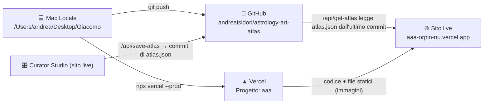

# AAA — Astrology Art Atlas
## Documento di Knowledge Transfer & Guida Operativa

Panoramica dell'architettura del progetto **Astrology Art Atlas (AAA)** per profili tecnici e per curatori: dove risiedono i file, chi gestisce gli account, come interagiscono i sistemi e quali passaggi seguire per ogni modifica.

*Ultimo aggiornamento: 8 ottobre 2026.*

---

## 1. La Mappa dell'Ecosistema


```mermaid
flowchart LR
    A["💻 Mac Locale<br/>/Users/andrea/Desktop/Giacomo"] -->|"git push"| B["🐙 GitHub<br/>andreaisidori/astrology-art-atlas"]
    A -->|"npx vercel --prod"| C["▲ Vercel<br/>Progetto: aaa"]
    E["🎛️ Curator Studio (sito live)"] -->|"/api/save-atlas → commit di atlas.json"| B
    B -->|"/api/get-atlas legge atlas.json dall'ultimo commit"| D["🌐 Sito live<br/>aaa-orpin-nu.vercel.app"]
    C -->|"codice + file statici (immagini)"| D
```

| Livello | Account | Identificativo / URL | Ruolo |
| :--- | :--- | :--- | :--- |
| **Locale (Mac)** | — | `/Users/andrea/Desktop/Giacomo` | Sviluppo e test locale. |
| **GitHub** | `andreaisidori` | [andreaisidori/astrology-art-atlas](https://github.com/andreaisidori/astrology-art-atlas) (pubblico) | Codice sorgente e **fonte di verità dei dati** (`public/data/atlas.json`). Unico remote (`origin`). |
| **Vercel** | `giacomoisidori-2449s-projects` | Progetto `aaa` | Hosting del sito e delle API serverless (`api/`). |
| **Sito live** | — | [aaa-orpin-nu.vercel.app](https://aaa-orpin-nu.vercel.app/) | Indirizzo pubblico. |

> Il vecchio remote `giacomo` (`github.com/giacomoisidori-atlas/aaa`) è stato rimosso l'8/10/2026: il repository non risulta esistente/accessibile.

### Come arrivano i dati al sito (importante)
- Il sito chiama `/api/get-atlas`, che legge `atlas.json` **dall'ultimo commit su GitHub**. Le modifiche ai testi/opere salvate dal Curator Studio sono quindi visibili **subito**, senza deploy.
- Il **codice** e i **file statici** (immagini in `public/`) arrivano online **solo con un deploy Vercel**.
- Conseguenza: se una modifica a `atlas.json` punta a nuovi file in `public/` (es. `public/artworks/…`), fare **prima il deploy Vercel e poi il push su GitHub**, altrimenti il sito live per qualche minuto punta a immagini non ancora pubblicate.

---

## 2. Struttura del Progetto

Single Page Application **React 18 + Three.js / React Three Fiber + Tailwind CSS**, compilata con **Vite 6**.

```
Giacomo/
├── api/                         # API serverless Vercel
│   ├── get-atlas.js             # Legge atlas.json dall'ultimo commit GitHub (fallback: file locale)
│   ├── save-atlas.js            # Salva atlas.json con commit su GitHub (richiede password curatore)
│   ├── verify-admin.js          # Verifica la password del Curator Studio
│   └── _auth.js                 # Controllo password condiviso (ADMIN_PASSWORD)
├── public/
│   ├── data/atlas.json          # DATABASE DEL PROGETTO (opere, info progetto, bio, note legali)
│   ├── artworks/                # Immagini delle opere caricate dal Curator Studio
│   ├── thumbnails/              # Miniature delle opere
│   └── images/                  # Logo e glifi zodiacali (gold / white)
├── src/
│   ├── components/3d/           # Spazio 3D: CelestialSphere, ArtworkNode, ConstellationLines,
│   │                            #   CelestialFloor, CameraController, CuratorSpatialEditor
│   ├── components/ui/           # Interfaccia 2D: Header, InfoModal, ArtworkModal, BioModal,
│   │                            #   ArchiveView, LandingScreen, ZodiacNav, LegalModal, …
│   ├── components/admin/AdminCuratorPanel.jsx   # Curator Studio
│   ├── utils/                   # astronomy.js (coordinate, palette segni), layouts.js
│   ├── App.jsx                  # Stato globale, caricamento e salvataggio dati
│   └── main.jsx
├── scripts/                     # Script una-tantum (temi natali degli artisti)
├── design/                      # Sorgenti grafici non usati dal sito (glifi originali, screenshot)
├── vite.config.js               # Dev server (porta 3000) + simulazione locale delle API
├── .env.local                   # NON versionato: ADMIN_PASSWORD per lo sviluppo locale
└── .vercel/project.json         # Collegamento al progetto Vercel "aaa"
```

---

## 3. Elementi Funzionali

### A. Database (`public/data/atlas.json`)
- `opere`: **181 voci** (stato all'8/10/2026). Di queste **168 sono segnaposto**: hanno artista, segno e dati biografici ma titolo "In attesa di caricamento opera..." e un'immagine stock generica. Le opere effettivamente compilate sono 13.
- `progetto.info`: testi concettuali, crediti e i 3 box informativi.
- `progetto.curatore`: biografia e contatti del curatore (Giacomo Isidori).
- `progetto.legal`: note legali.

### B. Colori dei segni e nodi 3D
Ogni segno ha una tinta definita in `src/utils/astronomy.js`; nodi e linee di costellazione la ereditano (Scorpione: antracite `#28282D`).

### C. Curator Studio (`AdminCuratorPanel.jsx`)
- Si apre dal pulsante con il lucchetto nell'header: si digita la password e si trascina il cursore.
- La password è verificata **dal server** (`/api/verify-admin`) e richiesta di nuovo a ogni salvataggio (`/api/save-atlas`). Il valore è nella variabile d'ambiente `ADMIN_PASSWORD`:
  - online: Vercel → progetto `aaa` → Settings → Environment Variables;
  - in locale: file `.env.local` (non versionato).
- "Salva & Committa" crea un commit di `atlas.json` su GitHub (serve `GITHUB_TOKEN`, già configurato su Vercel). Se il salvataggio non riesce, il pannello mostra un errore: non segnala più "salvato" quando non lo è.

### D. Limiti noti
- **Immagini caricate dal pannello**: vengono incorporate in `atlas.json` come base64, già alleggerite dal browser (immagine max 1200 px JPEG q80, miniatura separata max 320 px; circa 150–300 KB per opera). Vercel accetta richieste fino a **4,5 MB**: oltre **4 MB** il pannello blocca il salvataggio con un messaggio, senza perdere nulla. Per riportare il file leggero:
  ```bash
  git pull --rebase origin main
  node scripts/lighten-images.cjs          # anteprima
  node scripts/lighten-images.cjs --write  # applica (solo campi immagine/miniatura)
  npm run build && npx vercel --prod --yes # PRIMA il deploy...
  git add -A && git commit -m "chore: alleggerimento immagini" && git push origin main  # ...POI il push
  ```
  Soluzione definitiva: storage immagini (es. Supabase), se il progetto crescerà.
- **Modifica di un'opera dal modulo**: i campi non gestiti dal modulo (es. `anno_nascita`, ridondante con `data_nascita` e non usato dal sito) vengono rimossi al salvataggio.
- **Salvataggi concorrenti**: se due persone salvano insieme, vince l'ultimo salvataggio.

---

## 4. Guida Operativa

### Fase 1: Modifica
- **Testi e opere**: Curator Studio (online o in locale) oppure modifica diretta di `public/data/atlas.json`.
- **Grafica / interfaccia**: file in `src/components/...`.

### Fase 2: Test locale
```bash
npm run dev
```
Apri **`http://127.0.0.1:3000`**. In locale il Curator Studio salva direttamente su `public/data/atlas.json` (non su GitHub).

### Fase 3: Pubblicazione
Prerequisito una tantum: `npx vercel login` (la sessione resta salvata sul Mac) e credenziali GitHub nel portachiavi macOS. **Non inserire token nei comandi**: finiscono nella cronologia del terminale.

1. Allinearsi con eventuali salvataggi fatti dal Curator Studio online:
   ```bash
   git pull --rebase origin main
   ```
2. Deploy su Vercel (codice + immagini):
   ```bash
   npm run build && npx vercel --prod --yes
   ```
3. Push su GitHub (dati + storico):
   ```bash
   git add -A && git commit -m "Descrizione delle modifiche" && git push origin main
   ```

---

## 5. Domande Frequenti

> **Come cambio un testo dei 3 box della finestra info?**
> Dal Curator Studio, oppure in `atlas.json` (`box_1_titolo`, `box_1_testo`, …) seguito da commit e push: il sito lo mostra subito.

> **Come cambio la password del Curator Studio?**
> Vercel → `aaa` → Settings → Environment Variables → `ADMIN_PASSWORD` (Production, Preview e Development), poi un nuovo deploy. Aggiornare anche `.env.local` sul Mac.

> **I token scadono?**
> `GITHUB_TOKEN` su Vercel può scadere: se il salvataggio online risponde con errore GitHub, rigeneralo su `github.com/settings/tokens` (permesso *Contents: read & write* sul solo repository) e aggiorna la variabile su Vercel.
